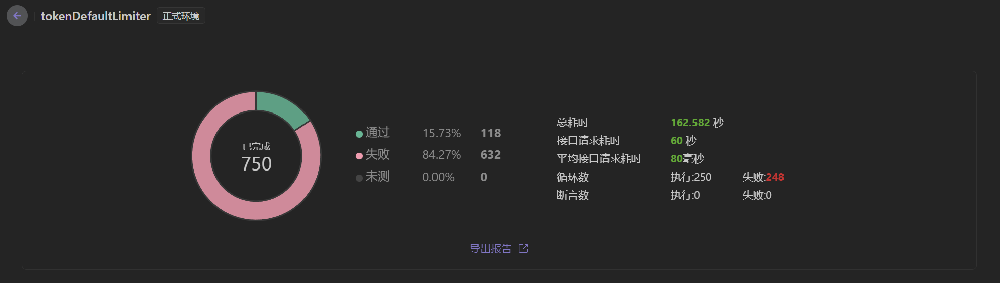

~~~ 
author: van , ggfanwentao@gmail.com
~~~
---

# Ip-Limit-Example: 轻量级注解式IP限流组件使用样例

## 项目简介
该项目为ip-limiter的使用示例项目。

ip-limiter地址： https://github.com/DDAaTao/ip-limiter

### 示例项目文件树
```
└─example
    ├─handler
    │   └─BaseExceptionHandler - IpLimiter统一异常处理
    ├─token - 令牌桶限流器相关示例/测试接口包
    │   ├─TokenDefaultLimiterTypeController - 默认限流样例
    │   └─TokenWhiteLimiterTypeController - 白名单模式限流样例
    ├─window - 滑动窗口限流器相关示例/测试接口包
    │   ├─DefaultLimiterTypeController - 默认限流样例
    │   ├─BlackLimiterTypeController - 黑名单限流样例
    │   ├─WhiteLimiterTypeController - 白名单限流样例
    │   └─DynamicIpListController - 黑白名单动态配置样例
    └─IpLimiterExampleApplication -  启动类(@EnableIpLimit)
```


**核心限流模式 - LimitType类**
- DEFAULT - 走默认限流策略,不考虑黑白名单参数
- WHITE_LIST - 只考虑白名单策略,非白名单的请求全部回绝
- BLACK_LIST - 只考虑黑名单策略,非黑名单请求不做限流措施
- DEFAULT_WITH_WHITE_LIST - 在默认限流策略的基础上,白名单内的IP不做限流
- DEFAULT_WITH_BLACK_LIST - 在默认限流策略的基础上,直接403黑名单
- DEFAULT_WITH_WHITE_AND_BLACK_LIST - 在默认限流策略的基础上,直接403黑名单,再让白名单内的IP直接同行

## 快速开始

1. 引入Ip-Limit依赖（已发布至Maven中央仓库）
```xml
  <!-- 建议使用最新版本{ip-limiter.version} -->
  <dependency>
    <groupId>io.github.DDAaTao</groupId>
    <artifactId>ip-limiter</artifactId>
    <version>1.0.3</version>
  </dependency>
```
2. 将 @EnableIpLimit 添加到 webApplication 类上,或其他可以被 Spring 扫描到的配置类上
3. 将 @IpLimit 注解添加到想要做IP限流的方法（接口）上，根据需求动态调整参数


4. 可通过注入 IpLimitUtils 动态设置限流配置 - DynamicIpListController


## 部分测试结果
> 性能上来讲，推荐使用滑动窗口限流
### 1.令牌桶默认限流 


### 2.滑动窗口默认限流 
